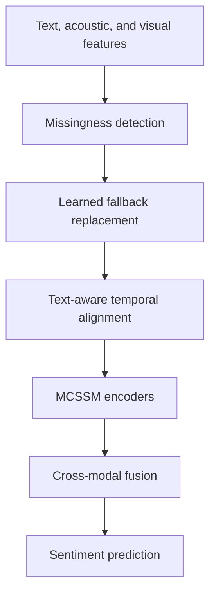

# CMS-Mamba

> Anonymous research repository. Author names, affiliations, contact details, and identifying repository links are intentionally withheld during peer review.

Official implementation of **“Robust Multimodal Sentiment Analysis under Incomplete Observations via Missingness-Conditioned State-Space Modulation.”**

CMS-Mamba is designed for multimodal sentiment analysis when acoustic and visual observations may be partially or completely unavailable. Its central component, **Missingness-Conditioned State-Space Modulation (MCSSM)**, uses explicit observation indicators to control state updates: reliable observations produce normal updates, whereas missing observations drive the effective state-space step toward zero and approximately preserve the previous latent state.

## Highlights

- Missingness-aware state-space updates for incomplete multimodal sequences.
- Automatic missingness detection for acoustic and visual features.
- Learned fallback tokens for missing acoustic and visual frames.
- Training with sample-wise stochastic missing ratios from 0% to 100%.
- Evaluation under clean inputs, seven acoustic/visual missingness patterns, distribution shift, and total modality absence.
- Validation-based checkpoint selection and multi-seed statistical testing.

## Method overview



For an input $x_t$ and observation indicator $m_t$, MCSSM computes

$$\alpha_t=\sigma(W_gx_t+W_mm_t+b_g), \qquad \Delta_t=\alpha_t\odot\operatorname{Softplus}(W_\Delta x_t+b_\Delta).$$

The modulated step $\Delta_t$ is used in the zero-order-hold discretization of the state-space model. As $\Delta_t\rightarrow0$, the transition approaches the identity and the input contribution approaches zero, so the latent state is approximately retained instead of being overwritten by an unreliable observation.

The learned missing-modality tokens and automatic detector support the full system but are not presented as the paper's primary methodological contribution.

## Missingness handling

### Acoustic and visual streams

Missingness is detected before fallback replacement and temporal alignment. A frame is marked missing when it is non-finite or exactly zero. The automatic detector additionally uses the standardized frame-energy score

$$q_t=\lVert \widetilde{x}_t\rVert_2/\sqrt{d},$$

where feature standardization is fitted only on the uncorrupted training split. A low-energy frame is marked missing only when an adjacent valid frame is also below the selected threshold, reducing isolated false alarms.

The validation-selected acoustic/visual thresholds used in the experiments are:

| Dataset | Acoustic | Visual |
|---|---:|---:|
| CMU-MOSI | 0.16 | 0.19 |
| CMU-MOSEI | 0.18 | 0.21 |
| CH-SIMS | 0.14 | 0.23 |
| IEMOCAP | 0.17 | 0.20 |

For CMU-MOSEI, the final common threshold scale was selected from $\{0.8,0.9,1.0,1.1,1.2\}$ using incomplete-input validation MAE on a frozen development checkpoint; the selected scale was 1.0.

### Text stream

Missing non-special text tokens are represented by `[UNK]`. Special tokens remain observed. Acoustic and visual indicators are aligned with the same text-aware alignment operators used for their corresponding features.

## Data and features

This work uses public benchmark features and the following fixed splits:

| Dataset | Task | Train | Validation | Test |
|---|---|---:|---:|---:|
| CMU-MOSI | Sentiment regression | 1,284 | 229 | 686 |
| CMU-MOSEI | Sentiment regression | 16,326 | 1,871 | 4,659 |
| CH-SIMS | Sentiment regression | 1,368 | 456 | 457 |
| IEMOCAP | Four-class emotion recognition | 3,259 | 1,031 | 1,241 |

IEMOCAP uses Sessions 1–3 for training, Session 4 for validation, and Session 5 for testing. The four classes are angry, happy (including excited), sad, and neutral.

Feature dimensions:

| Dataset group | Text | Acoustic | Visual |
|---|---:|---:|---:|
| CMU-MOSI / CMU-MOSEI / IEMOCAP | BERT, 768 | COVAREP, 74 | FACET, 35 |
| CH-SIMS | Chinese BERT, 768 | Librosa, 33 | OpenFace, 709 |

Please obtain each dataset from its official distributor and comply with its license and access conditions. Raw data are not redistributed by this repository.

## Environment

The reported experiments used:

| Component | Version |
|---|---|
| Python | 3.10.12 |
| PyTorch | 2.5.0 |
| CUDA | 12.6 |
| cuDNN | 9.3 |
| Transformers | 4.46.3 |
| `mamba-ssm` | 2.2.2 |

Install a PyTorch build compatible with the local CUDA stack, then install the remaining dependencies. Exact package commands may vary by platform.

```bash
conda create -n cms-mamba python=3.10.12
conda activate cms-mamba

# Install the appropriate PyTorch 2.5.0 build for your platform first.
pip install transformers==4.46.3 mamba-ssm==2.2.2
```

## Reproduction protocol

The repository entry-point filenames are not specified here because they were not part of the manuscript materials used to prepare this anonymous README. When connecting this document to the released source tree, preserve the protocol below and replace this note with the exact training and evaluation commands.

1. Obtain the benchmark features and construct the fixed train/validation/test splits above.
2. Fit feature standardization on the uncorrupted training split only.
3. During training, sample one missing ratio $\eta\sim\mathcal{U}(0,1)$ per example and apply Bernoulli masks to eligible positions in the acoustic and visual streams.
4. Optimize the sentiment objective together with masked Smooth-L1 reconstruction on artificially removed observations.
5. Select checkpoints using the lowest mean validation MAE over $\eta\in\{0,0.1,0.3,0.5,0.7\}$ and three fixed validation masks.
6. Evaluate clean inputs and the seven acoustic/visual corruption patterns using independent test masks.
7. Report results over five model seeds: 2024, 2025, 2026, 2027, and 2028.

The validation mask seeds are 1111, 2222, and 3333. The test mask seeds are 1111, 2222, 3333, 4444, and 5555.

## Training configuration

Shared settings:

- Optimizer: AdamW
- Initial learning rate: $10^{-4}$
- Weight decay: $10^{-4}$
- Schedule: 10% warm-up followed by cosine decay
- Batch size: 64
- Maximum epochs: 200
- Early-stopping patience: 20
- Gradient clipping: 1.0
- Training precision: FP32
- Hidden dimension: 128
- Attention heads: 8

Dataset-specific settings:

| Dataset | Context/query layers | SSM state size | Expansion | Dropout | Reconstruction weight |
|---|---:|---:|---:|---:|---:|
| CMU-MOSI | 1 / 1 | 12 | 4 | 0.1 | 0.7 |
| CMU-MOSEI | 2 / 2 | 16 | 4 | 0.2 | 0.3 |
| CH-SIMS | 1 / 2 | 16 | 2 | 0.2 | 1.0 |

All configurations use convolution kernel size 4. IEMOCAP uses cross-entropy plus reconstruction loss with reconstruction weight 0.3 and no class weighting.

## Main results

### CMU-MOSEI

CMS-Mamba-Auto achieves the following five-seed results:

| Setting | MAE ↓ | Correlation ↑ | F1 ↑ |
|---|---:|---:|---:|
| Clean input | 0.5491 ± 0.0018 | 0.7598 ± 0.0024 | 0.8076 ± 0.0015 |
| Seven-pattern macro | 0.6775 ± 0.0015 | 0.5791 ± 0.0023 | 0.7326 ± 0.0018 |

Against the TF-Mamba backbone, the seven-pattern macro MAE improves from 0.6979 to 0.6775, a paired reduction of 0.0204 with 95% confidence interval $[0.0130,0.0278]$, Holm-adjusted $p=0.0031$, and $d_z=3.42$.

Adding MCSSM-Auto consistently improves three Mamba-family backbones:

| Backbone | Original MAE ↓ | + MCSSM-Auto MAE ↓ | Reduction |
|---|---:|---:|---:|
| TF-Mamba | 0.6979 | 0.6863 | 0.0116 |
| MSL-Mamba | 0.6748 | 0.6671 | 0.0077 |
| Vanilla Mamba | 0.7162 | 0.7029 | 0.0133 |

MSL-Mamba with MCSSM-Auto is the strongest deployable configuration tested in the cross-backbone comparison, with macro MAE 0.6671. Several strong baselines have lower point estimates than CMS-Mamba-Auto in the main comparison, but the differences are not significant after Holm correction; the paper therefore does not claim universal state-of-the-art performance.

### Cross-dataset results

| Dataset | Summary |
|---|---|
| CH-SIMS | Clean MAE improves from 0.4492 to 0.4421 and clean binary accuracy from 73.52% to 77.84%. At the most severe endpoint, binary accuracy improves from 60.61% to 65.18%, while MAE changes from 0.6513 to 0.6584, showing a metric trade-off. |
| IEMOCAP | Incomplete-input weighted F1 improves from 63.17% to 65.28%; gain 2.11 points, 95% CI $[0.88,3.34]$, $p=0.009$. |

Under out-of-distribution corruption schedules, the method improves mean MAE in 11 of 12 settings, with an average reduction of 0.0180.

## Efficiency

| Model | Parameters | MACs |
|---|---:|---:|
| TF-Mamba | 3.24 M | 0.86 G |
| CMS-Mamba-Auto | 3.31 M | 0.89 G |

On the evaluated Jetson setup at batch size 16, end-to-end latency is approximately 80.66–81.15 ms for CMS-Mamba-Auto and 90.35–90.62 ms for TF-Mamba. The measured speedup is implementation-specific and is attributed to contiguous layouts and cached tensors, not to lower theoretical complexity. Energy per batch is higher for CMS-Mamba-Auto in the clean setting (0.0501 J versus 0.0407 J).

These end-to-end measurements start from released feature sequences and therefore exclude raw audio/video feature extraction and text encoding.

## Evaluation notes

- The seven-pattern macro averages clean input and six non-clean acoustic/visual missingness conditions.
- Exact-zero and non-finite observations are hard-covered by the detector in the controlled protocol.
- Detector quality alone does not determine downstream accuracy: the learned detector obtains higher frame-level F1 than the heuristic detector but slightly worse downstream MAE.
- Report both clean and incomplete-input performance because robustness gains can involve dataset- and metric-specific trade-offs.
- Total modality absence evaluates fallback behavior, not semantic reconstruction of information that was never observed.

## Limitations

- Detector thresholds may require validation-based recalibration under different feature scaling or preprocessing pipelines.
- Experiments use released features and transcripts rather than raw sensor streams.
- Cross-backbone evidence is limited to three Mamba-family models.
- External pretrained fallback models were not evaluated.
- Edge measurements cover one hardware platform and one implementation.
- Results under complete modality removal should not be interpreted as recovery of missing semantic content.

## Citation

Citation metadata are anonymized during review:

```bibtex
@article{anonymous2026cmsmamba,
  title   = {Robust Multimodal Sentiment Analysis under Incomplete Observations via Missingness-Conditioned State-Space Modulation},
  author  = {Anonymous},
  year    = {2026},
  note    = {Manuscript under anonymous review}
}
```

Please replace this entry with the final bibliographic record after the review process.

## Anonymous-review notice

This repository is provided solely to support reproducibility during anonymous peer review. Please avoid opening issues or discussions that attempt to identify the authors. Identifying metadata and permanent archival links will be added after the review process.
